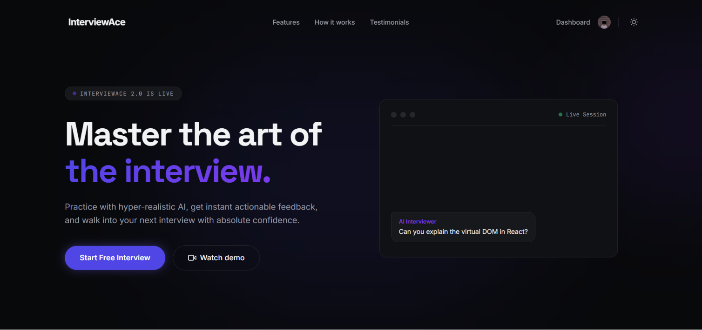

<div align="center">
  

  # InterviewAce
  **Your AI-Powered Technical Interview Companion**

  [](https://opensource.org/licenses/MIT)
  [](https://react.dev/)
  [](https://expressjs.com/)
  
  [Live Demo](https://interview-ai-ten-psi.vercel.app/) • [Architecture Docs](./docs/architecture.md) • [Case Study](./docs/case_study.md)
</div>

---

## 🚀 The Pitch
Technical interviews are stressful, unpredictable, and difficult to prepare for alone. **InterviewAce** solves this by providing a highly realistic, AI-driven mock interview environment. Upload your resume, and our system (powered by Google Gemini) instantly parses your experience to generate tailored, challenging technical questions. Practice in real-time, get immediate constructive feedback, and track your performance trends over time.

It's not just another generic quiz app; it's a personalized interview coach built on a robust, modern, full-stack architecture.

## ✨ Key Features
- **Smart Resume Parsing:** Upload a PDF resume; we extract the text and tailor the interview context to your actual experience.
- **Dynamic AI Interviews:** Google's Gemini 1.5 Flash acts as the interviewer, focusing on relevant technical questions and grading your responses with high efficiency.
- **Ultra-Realistic Voice (TTS):** Integrated Deepgram Aura for natural, low-latency text-to-speech to simulate real interview conversations.
- **Immersive Interview UI:** Full-screen live interview experience featuring auto voice recording and a streamlined chat interface.
- **Enterprise-Grade Security:** Fully integrated with Clerk for secure, seamless authentication (both client and server-side verification).
- **Performance Analytics:** Visual tracking of your interview scores over time using interactive Recharts.
- **Polished UI/UX:** Built with React 19, Vite, and Tailwind CSS v4, featuring smooth micro-animations via Framer Motion.

## 💻 Tech Stack
InterviewAce uses a modern, strictly separated client/server architecture.

| Layer | Technology | Why we chose it |
|-------|------------|-----------------|
| **Frontend** | React 19 + Vite | Fast HMR, excellent developer experience, and modern concurrent features. |
| **Styling** | Tailwind CSS v4 + Framer Motion | Utility-first styling for rapid, consistent UI development, plus robust animation primitives. |
| **State & Data** | React Query + Axios | Powerful server-state management with built-in caching, retry, and deduplication logic. |
| **Backend** | Express.js 5 + Node.js | Fast, unopinionated server framework. Express 5 brings better native Promise handling. |
| **Database** | MongoDB + Mongoose | Flexible NoSQL document structure, ideal for rapidly iterating on user profiles and interview sessions. |
| **AI Engine** | Google Gemini 1.5 Flash (`@google/genai`) | State-of-the-art LLM capabilities with excellent context window for parsing long resumes and maintaining conversation state. |
| **Voice & Speech** | Deepgram Aura | Ultra-realistic, low-latency Text-to-Speech API for seamless, real-time conversational experiences. |
| **Auth & Security** | Clerk, Helmet, CORS, Rate Limit | Clerk handles complex auth flows securely; Helmet and express-rate-limit protect against common web vulnerabilities. |

## 🏁 Quick Start

### 1. Clone & Install
```bash
git clone https://github.com/shubham574/InterviewAI.git
cd InterviewAI

# Install Client Dependencies
cd client && npm install

# Install Server Dependencies
cd ../server && npm install
```

### 2. Environment Variables
You'll need two `.env` files.

**`client/.env`**
```env
VITE_CLERK_PUBLISHABLE_KEY=your_clerk_publishable_key
VITE_API_URL=http://localhost:5000
```

**`server/.env`**
```env
PORT=5000
MONGODB_URI=your_mongodb_connection_string
CLERK_SECRET_KEY=your_clerk_secret_key
GEMINI_API_KEY=your_gemini_api_key
```

### 3. Run Locally
Open two terminal windows:

**Terminal 1 (Backend):**
```bash
cd server
npm run dev
```
*Server runs on http://localhost:5000*

**Terminal 2 (Frontend):**
```bash
cd client
npm run dev
```
*Client runs on http://localhost:5173*

## 🧪 Demo Login
Want to test the app? Sign up for a free account—it takes under a minute!

## 📚 Documentation
- [Architecture & Design](./docs/architecture.md)
- [Project Case Study](./docs/case_study.md)
- [Contributing Guidelines](./CONTRIBUTING.md)
- [Changelog](./CHANGELOG.md)

## 📄 License
This project is licensed under the [MIT License](./LICENSE).
