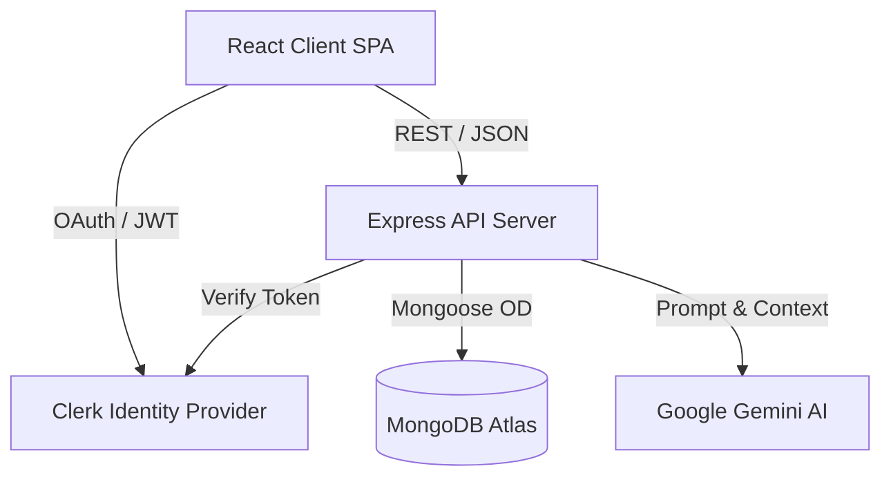

# Architecture Document: InterviewAce

This document provides a high-level overview of the InterviewAce system architecture, design decisions, and data flow.

## 1. System Overview

InterviewAce is a Single Page Application (SPA) communicating with a RESTful Node.js backend. The system is designed to be highly decoupled, allowing independent scaling of the client, server, and database.

## 2. Component Details

### 2.1. Client (Frontend)
- **Framework:** React 19 via Vite.
- **Routing:** React Router v7 for client-side navigation.
- **State Management:**
  - *Server State:* React Query handles fetching, caching, and updating asynchronous data from the API.
  - *Local State:* React Context and `useState` for transient UI state.
- **Styling:** Tailwind CSS v4 for utility-first styling, ensuring a small CSS bundle. Framer Motion handles complex layout animations.

### 2.2. Server (Backend)
- **Framework:** Express.js 5. Provides robust routing and middleware capabilities, with native support for Promise-based route handlers.
- **Architecture Pattern:** MVC/Controller-Service pattern.
  - `routes/`: Defines HTTP endpoints and maps them to controllers.
  - `controllers/`: Handles HTTP request/response logic and input validation.
  - `services/`: Contains the core business logic (e.g., calling Gemini API, parsing PDFs).
  - `models/`: Mongoose schemas defining the data structure.
- **Security Middleware:**
  - `helmet`: Sets secure HTTP headers.
  - `express-rate-limit`: Prevents brute-force and DDoS attacks.
  - `cors`: Configured to only allow requests from the trusted client domain.
  - `express-validator`: Sanitizes and validates incoming request bodies.

### 2.3. Database (MongoDB)
- A NoSQL document database is used to store user profiles, resume metadata, and interview session histories.
- Mongoose provides schema validation and relationship mapping (e.g., linking an `InterviewSession` document to a specific `User` document).

## 3. Core Workflows

### 3.1. Authentication Flow
1. User clicks "Login" on the client.
2. Clerk handles the OAuth/Password flow via its hosted UI or components.
3. Clerk returns a short-lived JWT to the client.
4. Client attaches this JWT as a Bearer token in the `Authorization` header for all requests to the backend.
5. The Express server uses `@clerk/express` middleware to cryptographically verify the JWT before allowing access to protected routes.

### 3.2. Resume Parsing & Interview Generation
1. User uploads a PDF resume via the client (`react-dropzone`).
2. The file is sent as `multipart/form-data` to the server.
3. `multer` middleware buffers the file in memory (or saves temporarily to disk).
4. `pdf-parse` extracts raw text from the PDF.
5. The `InterviewService` constructs a prompt containing the user's resume text and requests Google Gemini (`@google/genai`) to generate 5 tailored technical questions.
6. The AI response is parsed and saved to MongoDB as a new `InterviewSession`.
7. The JSON response is returned to the client to begin the interactive mock interview.
